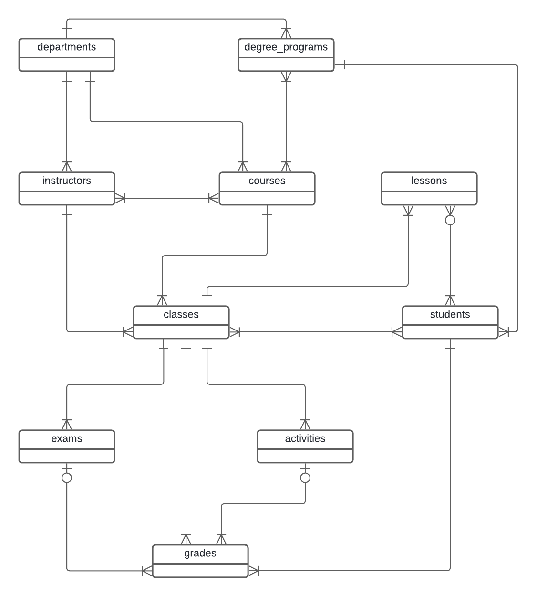

# My Moodle

## Projeto para praticar modelagem de banco de dados simulando o Moodle.

### Diagrama de Classes

Este projeto foi inspirado no Moodle como um sistema acadêmico. O banco de dados conta com diversas tabelas, funções, procedures, triggers, transactions, jobs, etc que permitem o funcionamento de uma universidade.

Dentro de um semestre ocorre todo o ciclo de criação, progresso e finalização das turmas. No início do semestre, as turmas são criadas e cada uma é associada a um professor. Por meio de uma procedure, o sistema valida se o professor é habilitado para ministrar para esta turma e se sua carga horária não foi esgotada. Em seguida, os alunos são matriculados na turma por meio de outra procedure. Para cada aluno, o sistema valida se todas as disciplinas que são pré-requisitos foram cumpridas e se a carga horária do aluno não foi esgotada. Além disso, o professor cadastra as atividades, provas e aulas e seus temas, cumprindo o cronograma.

Durante o semestre, os professores lançam as notas e presenças dos alunos. Desta forma, ao fim do semetre o sistema compila, por meio de uma view materializada, os dados nos boletins dos alunos, de forma que estes resultados possam ser utilizados para consulta dos estudantes e validação de novas matrículas no próximo semestre.